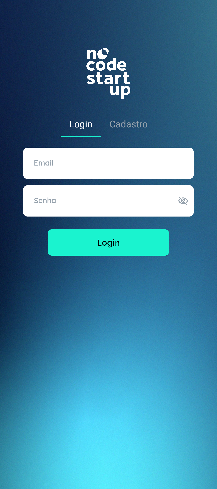
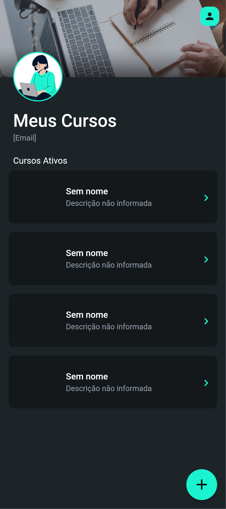
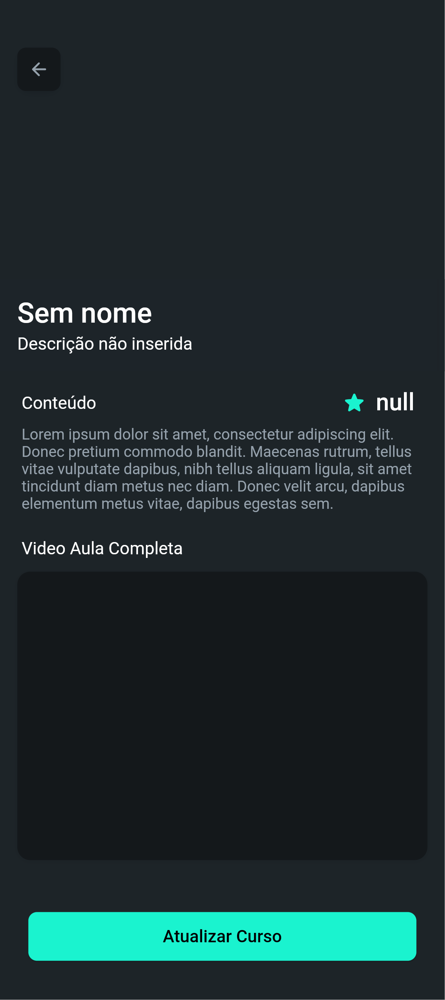

# 🎓 O App dos Seus Cursos Online

Esse é um app simples e funcional para você organizar e acompanhar seus cursos!

Com ele, você consegue:

- ✅ Fazer login ou cadastro com segurança  
- 📚 Visualizar uma lista de cursos disponíveis  
- 📝 Acessar os detalhes de cada curso  
- 📊 Acompanhar o progresso do que está estudando  
- 📱 Usar direto do navegador, sem precisar baixar nada!

---

## 🔗 Acesse o app publicado

https://seuappdecursos.flutterflow.app

---

## 📸 Prints do app

### 📍 Página "Login"  

### 📍 Página "Meus Cursos"  

### 📍 Página "Detalhes do Curso"  

---

## 🛠️ Tecnologias usadas

- FlutterFlow (no-code)  
- Supabase (back-end)  
- Publicação via FlutterFlow Web Deploy

---

## 🧠 Sobre o projeto

Este app foi desenvolvido como parte de um estudo prático com FlutterFlow + Supabase.  
A proposta é criar uma plataforma educacional simples e funcional com autenticação e banco de dados integrados.

---

## 👩‍💻 Desenvolvido por

**Gabriela Luz**  
[github.com/gabrielaluzm](https://github.com/gabrielaluzm)  
[linkedin.com/in/gabrielaluzm](https://linkedin.com/in/gabrielaluzm)

---

## 💬 Observação

Esse repositório é apenas informativo e serve como portfólio visual.
